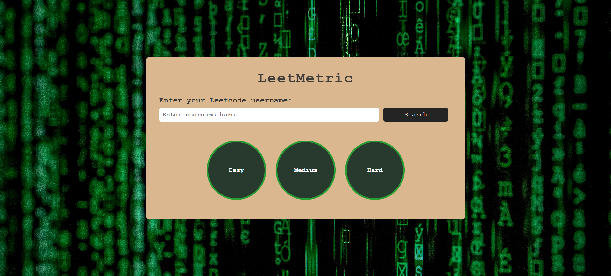

# 🚀 LeetMetric

LeetMetric is a sleek and interactive web app that visualizes your **LeetCode profile stats** using dynamic progress indicators and clean UI — just by entering your LeetCode username.  
Whether you're tracking your daily grind or showing off your rankings, LeetMetric makes it effortless and elegant.

---

## 🌐 Live Website

🔗 [Visit LeetMetric](https://hetashah30.github.io/LeetMetric/)  

---

## 🛠 Tech Stack

- **HTML5** – Structure the layout
- **CSS3** – Styling and circular progress animation
- **JavaScript** – DOM manipulation and API integration
- **LeetCode Stats API** – Fetch real-time user stats from:  
  `https://leetcode-stats-api.herokuapp.com/:username`
- **GitHub Pages** – Deployment

---

## 🎥 Project Demo

[](https://www.youtube.com/watch?v=3m3oJtNNKHE)

---

## 📸 Screenshots

| Home Page | After Search |
|-----------|--------------|
|  |  |

---

## ✨ Features

- Input your LeetCode username and visualize:
  - Total solved questions
  - Difficulty-wise progress (Easy, Medium, Hard)
  - Ranking, Reputation, and Acceptance Rate
- Circular progress bars for visual insights
- Glitchy animated heading (`LeetMetric`)
- Fully responsive design for mobile and desktop

---

## 📁 Folder Structure

```
├── index.html
├── style.css
├── script.js
├── /screenshots
│ ├── home.png
│ └── results.png
└── README.md
```

---
